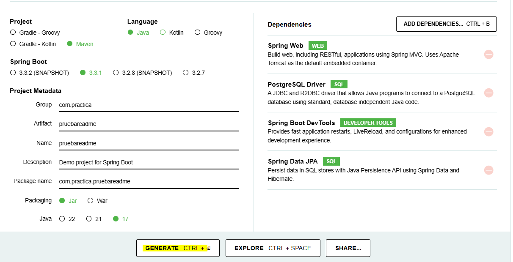

                                        PROJECT SET UP
Java JDK17   
Maven: versión 4 en adelante
Postgres: versión 16 en adelante   
IDE IntelliJ IDEA  
Dependencia Jackson del repositorio de maven https://mvnrepository.com/artifact/com.fasterxml.jackson.core/jackson-databind/2.17.1

Configuración al crear el proyecto en Spring Initializr:

Java (versión 17 en adelante)
Maven (Initializr utiliza la versión 4)
Spring Boot (versión 3.2.3)
Proyecto en JAR
Dependencias para agregar al crear el proyecto en Spring Initializr:
- Spring Data JPA  
- Postgres Driver
- Dev Tools
- Spring Web

                                          SERVICE DETAIL

Conección a la API Gutendex  https://gutendex.com/

Opciones disponibles del challege
1.Buscar libro por titulo  
2.Listar libros registrados  
3.Listar autores registrados  
4.Listar autores vivos en un determinado año  
5.Listar libros por idioma  
6.Salir